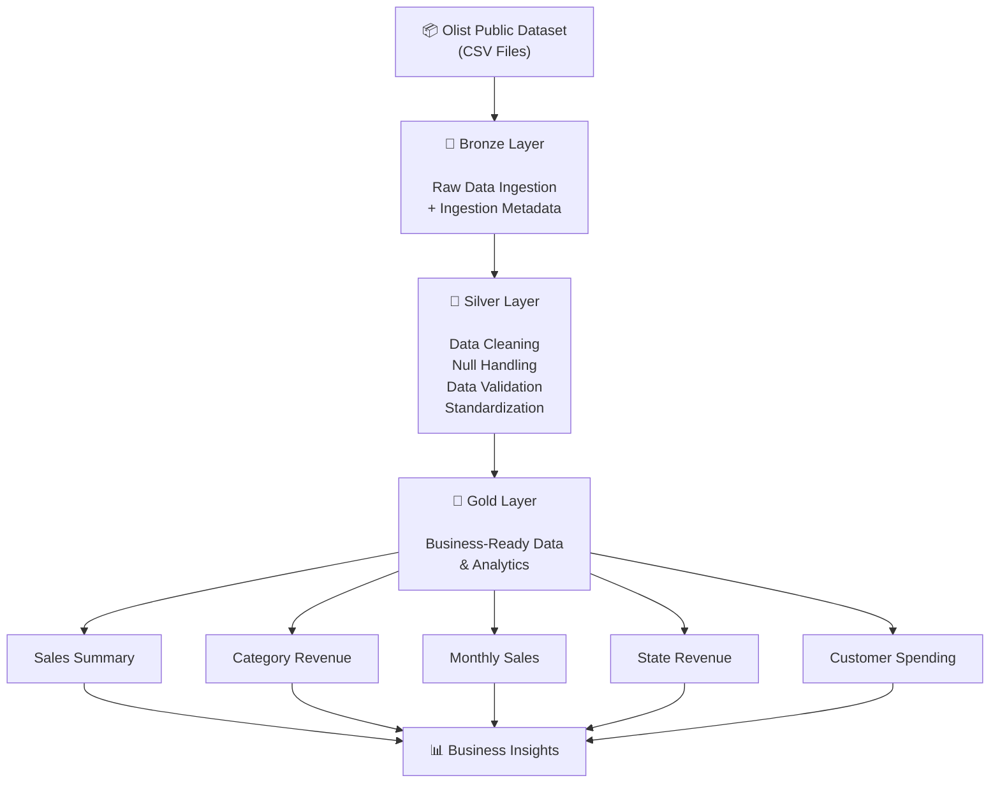

# Olist E-Commerce Data Engineering Project

## Overview

An end-to-end data engineering project built using PySpark and
Databricks to process and analyze Brazilian e-commerce data, data source is 
https://www.kaggle.com/datasets/olistbr/brazilian-ecommerce

## Technologies

- Python
- PySpark
- Apache Spark
- Databricks
- SQL
- Delta Lake
- Parquet

##Architecture  
## Project Architecture


## Bronze Layer

- Ingested raw CSV datasets
- Added ingestion metadata
- Stored data in Parquet format

## Silver Layer

- Data cleaning
- Null handling
- Duplicate checks
- Data type transformations
- Column standardization

## Gold Layer

- Joined orders, order items, products and customer data
- Created sales aggregations
- Calculated total sales and average order value
- Generated category and state-level sales analysis

## Project Structure
```text
notebooks/
├── bronze_layer_data_ingestion.py
├── silver_layer_data_transformation.py
└── gold_layer_analytics.py
```
